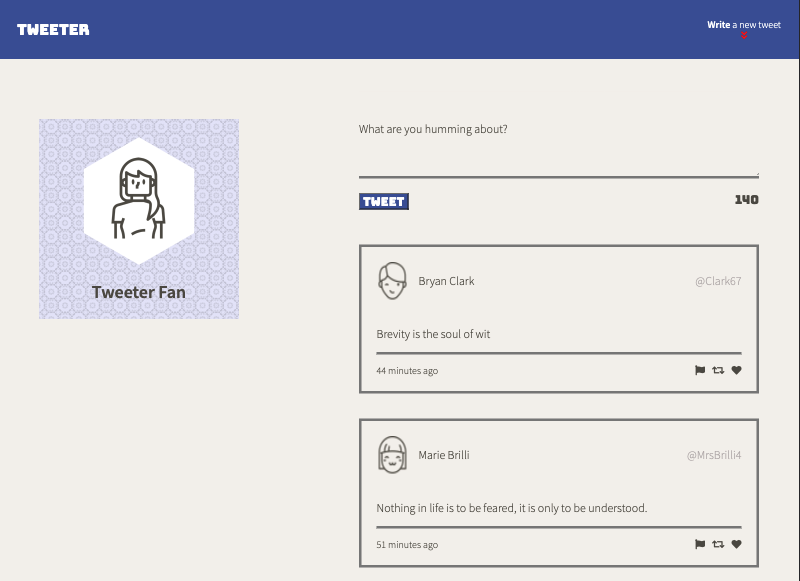
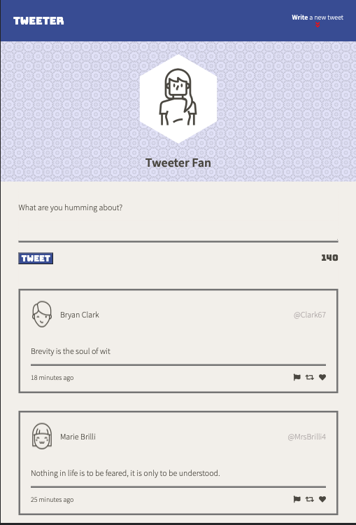
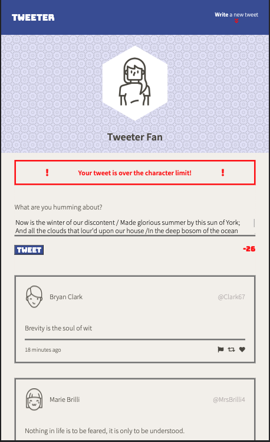

# Tweeter Project

Tweeter is a simple, single-page Twitter clone built using HTML, CSS, JS, jQuery, and Ajax.

## Tweeter Features

Nice, clean desktop for all your tweets.

Responsive layout adjusts to your smartphone or tablet for a comfortable experience.

Tweet your messages in 140 characters or less.

## Getting Started

1. Install dependencies using the `npm install` command.
2. Start the web server using the `npm run local` command. The app will be served at <http://localhost:8080/>.
3. Go to <http://localhost:8080/> in your browser.

## Dependencies

- Express
- Node 5.10.x or above
